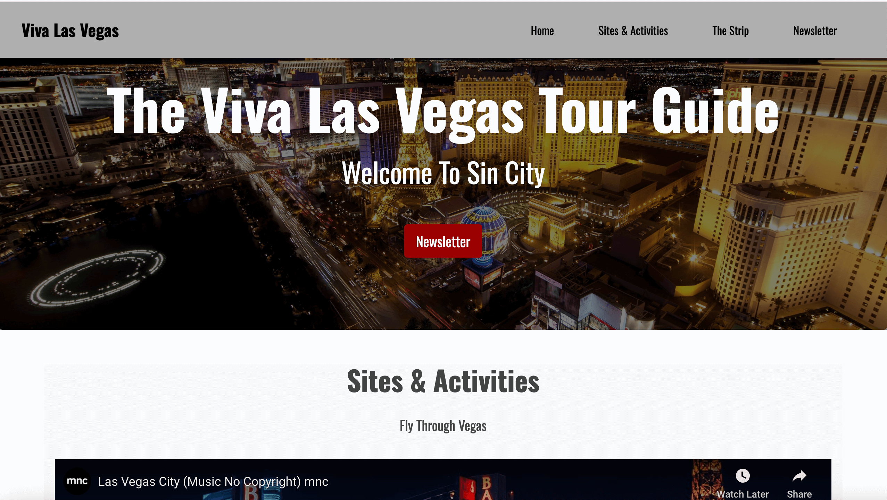
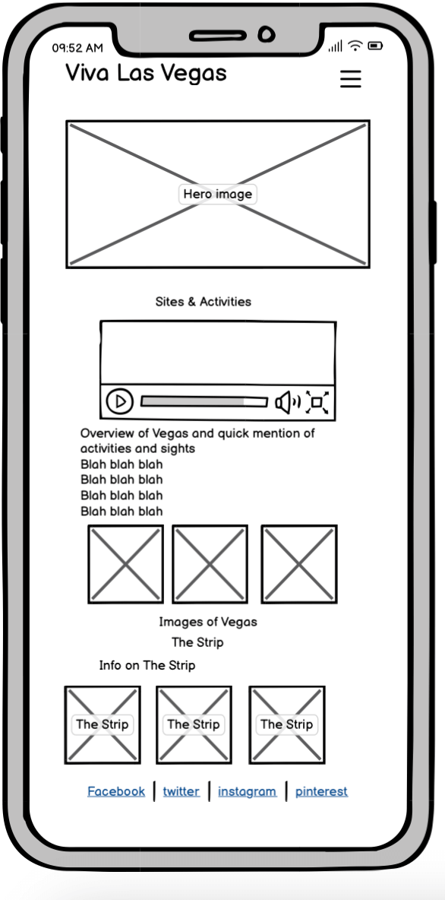
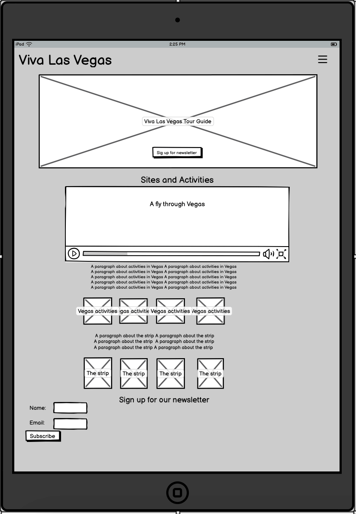
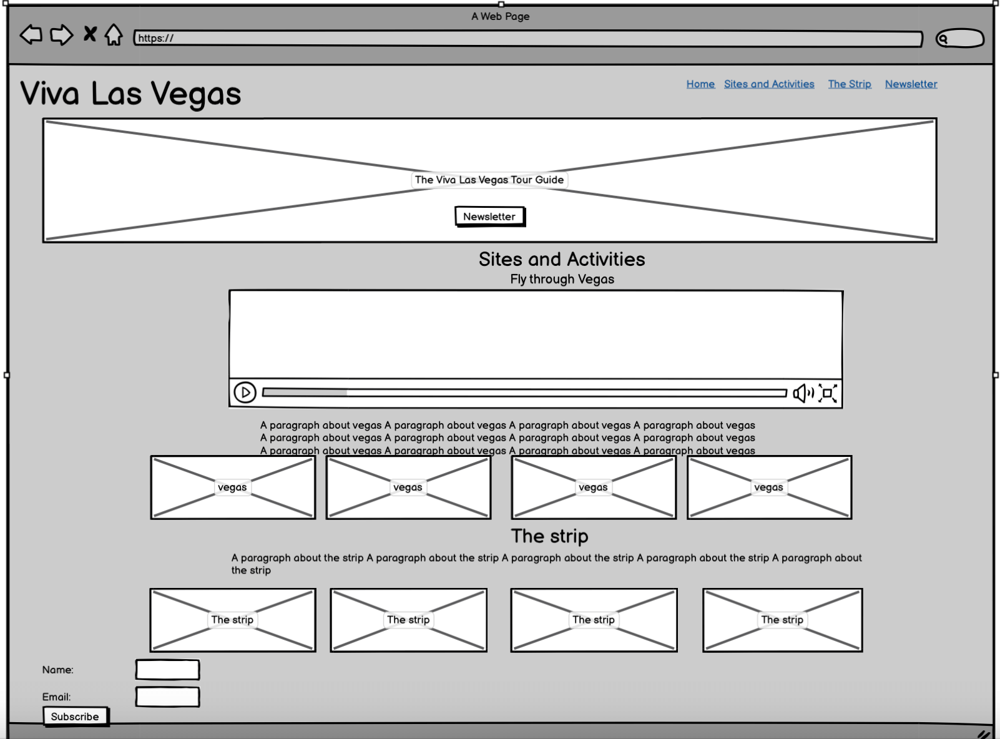
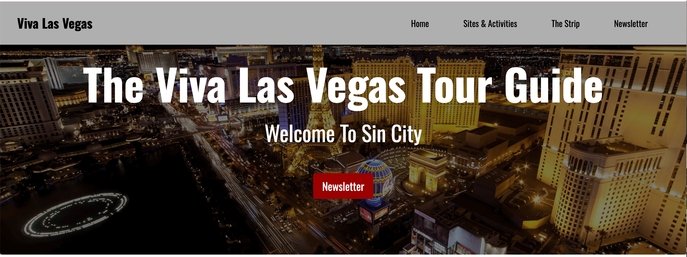
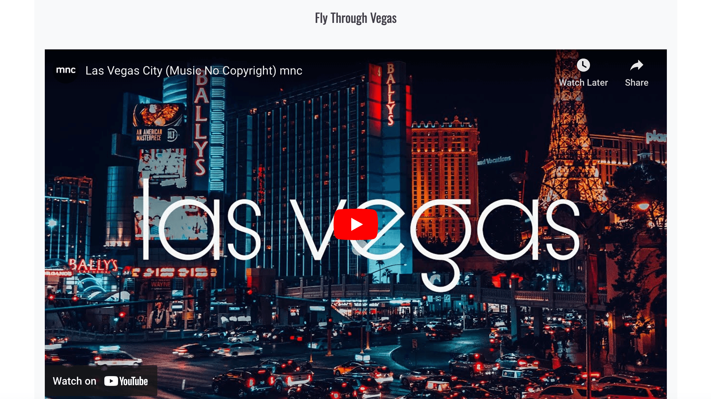
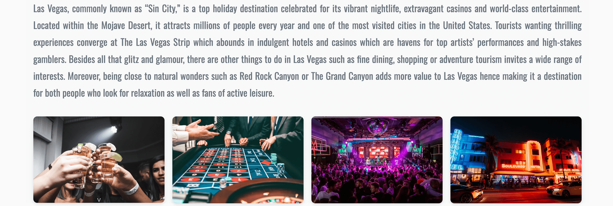
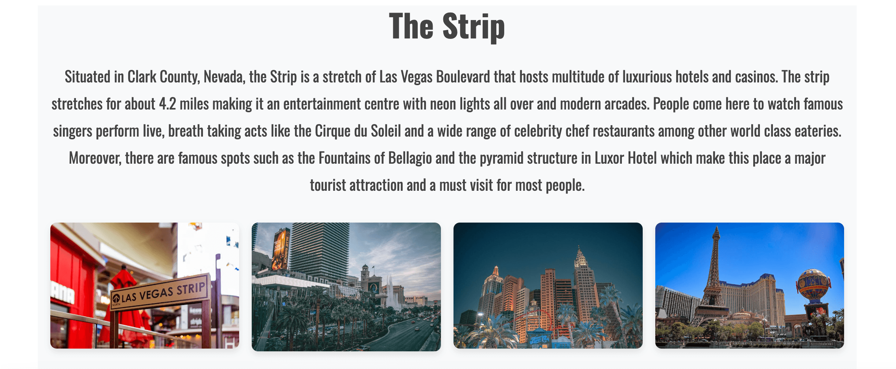
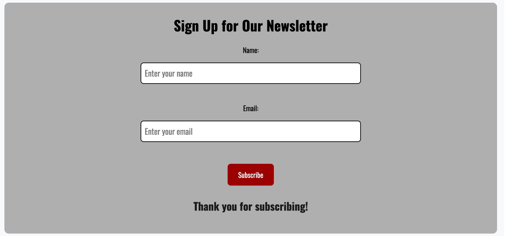

> 
> 

# Viva Las Vegas

> [View live project here](https://jwcurtis94.github.io/vivalasvegas/)
> 
> This is a visitor guide to Las Vegas giving the user ideas on where to go and what to see in an easy to navigate and fun way. Accessible on a range of devices it is a handy way to get tourist information on this amazing destination.
---
> RESPONSIVITY IMAGES - insert here
>
---

## CONTENTS

 - [User experience design (UXD)](#user-experience-design)
		 
     - user stories
 - [Creation process](#creation-process)
		 
     - [Wireframes](#wireframes)
 - [Design](#design)
		 
     - Colour scheme
		 
     - Typography
		 
     - Imagery
 - [Website features](#website-features)
 - [Tablet/mobile view](#tablet/mobile-view)
 - [Future features](#future-features)
 - [Technologies used](#technologies-used)
 - [Deployment](#deployment)
 - [Testing](#testing)
 - [Credits](#credits)
 ---
 ## USER EXPERIENCE DESIGN
 
 - **First time visitor goals**
		 
     * As a first time visitor I want to know what the aim of the site is and the information I can gain from it
		 
     * As a first time visitor I want to be able to navigate the site easily and be able to return to different sections
		 
     * As a first time user I want to be able to view the site on a variety of different devices and have the content appear in a logical way
		 
- **Returning visitor goals**
		
    
    * As a returning visitor I want to be able to find more in depth information about Las Vegas
		
    * As a returning visitor I want to be able to find where to go for more information

- **Frequent visitor goals**
		
    * As a frequent visitor I want to be able to sign up for a newsletter
---

## CREATION PROCESS

  ### Wireframes

Mobile Wireframe

  

Tablet Wireframe

  

Desktop Wireframe

  

---

## DESIGN
  - **Typography**
    
    [Google Fonts](https://fonts.google.com/) was used to provide the Poppins font chosen
  - **Colour scheme**
    
    The colour scheme chosen was predominantly black, white and shades of light grey to give a minimal and stylish look to the site without detracting from the colourful images of the city. A red was chosen to highlight the call to action button and is echoed when the menu items are hovered over.
  - **Imagery**
    
    The images chosen were felt to represent the fun and dynamic nature of Las Vegas and also it's contrasting feel from day to night.
    The hero image was chosen to make a statement and make the user want to find out more about the city.
    The images in the feature sections were chosen to represent the wide array of activities and places to visit in Vegas.
    [Pexels](https://www.pexels.com/) and [Wallpaper Cave](https://wallpapercave.com/) were used to provide the royalty-free stock images used. Acknowledgements for the individual photographers are in the [credits](#credits) section.

    The video on the landing page is a mnc no copyright music video from [YouTube](https://www.youtube.com/embed/pzO4Au1YN2k?si=fgwEbX2rrtiWhRXX) 

 ---

## WEBSITE FEATURES

  **NAVBAR**
  

  The navbar appears as above on desktop and laptops with the menu links collapsing down to a burger icon on tablet and mobile screens. It remains at the top of the screen during scrolling.

  **HERO IMAGE**
  

  
hero image

  The hero image remains the same across all devices

 

  **FLY THROUGH**
  

  
Fly through image

  The fly through feature is a video showcasing many different areas of the city through day and night. It is set not to start automatically allowing the user to decide whether or not they want to play the video.

   

  **ACTIVITIES FEATURE**
  

  
Activities image

  The activities feature gives information on the city and shows images of the activities available each of which comes to the forefront when hovered over.

   

  **THE STRIP FEATURE**
  

  
The Strip image

  The images in Strip feature operate in the same way as the Activities feature.

   

  **NEWSLETTER FEATURE**
  

  
Newsletter image

 ---

## FUTURE FEATURES
The following would be options to coonsider including in future versions of the website:
  - more sections added to include 'Where to get married', 'The best casinos', 'Tours', and 'Clubs'

  - the ability to book hotels

  - a dedicated gallery page

## TECHNOLOGIES USED

  ### Languages used
  - HTML5

  - CSS

  ### Frameworks, libraries and programs used

   
  1. [Bootstrap 4.6](https://getbootstrap.com/docs/4.6/getting-started/introduction/)
        - Bootstrap was used to ensure the site was responsive and for styling
  2. [Balsamiq](https://balsamiq.com/wireframes/)   
        - Balsamiq was used to produce the wireframes in the design phase.
  3. [Git](https://git-scm.com/)
        - Git was used for version control
  4. [Github](https://github.com/)
        - GitHub was used to store the code and allow collaboration on the project.
  5. [Google Fonts](https://fonts.google.com/)
        - Google Fonts was used for the custom fonts
  6. [Tiny.PNG](https://tinypng.com/)
        - Tiny.PNG was used to compress images
  7. [StackEdit](https://stackedit.io/)
        - StackEdit was used to assist with the markdown in the README.md
  8. [Google Chrome Dev Tools](https://developer.chrome.com/docs/devtools)
        - Used to troubleshoot and test design ideas and styling.   
  9.  [Google Lighthouse](https://developer.chrome.com/docs/lighthouse/overview)  
        - used to test performance of the website
  10. [Favicon](https://favicon.io/#google_vignette)
        - used to generate the favicon  
  11. [W3 Schools](https://www.w3schools.com/)
        - used to look up syntax for HTML and CSS
  12. [Stack Overflow](https://stackoverflow.com/)                  
        - used for queries around coding
  13. [Perplexity](https://www.perplexity.ai/)    
        - used to provide sources to generate text for the website   
  14. [Wikipedia](https://www.wikipedia.org/)      
        - used to generate text
  15. [Write human](https://www.writehuman.ai)
        - used to humanise generated text
  16. [Wallpaper cave](https://wallpapercave.com/)    
        - used for copyright free images
  17. [Pexels](https://www.pexels.com/)
        - used for copyright free images
  18. [W3C HTML validator](https://validator.w3.org/)
        - used to validate the HTML
  19. [W3 Jigsaw](https://jigsaw.w3.org/css-validator/)
        - used to validate the CSS

 ---

## DEPLOYMENT
The site was deployed via GitHub using the following steps:
1. Log in to GitHub account
2. Go to the Settings tab of the vivalasvegas repository
3. On the left-hand sidebar, in the Code and automation section, select Pages
4. Make sure:
    - Source is set to 'Deploy from Branch'.
    - Main branch is selected.
    - Folder is set to / (root).
5. Under Branch, click Save.
6. Go back to the Code tab. Wait a few minutes for the build to finish and refresh the repository.
7. On the right-hand side, in the Environments section, click on 'github-pages'.
8. Click View deployment to see the live site    

 ---

## TESTING
  The W3C Markup Validator and W3C CSS Validator Services were used to validate all pages of the code to ensure there were no syntax errors.
    
  - [W3C Markup Validator](https://validator.w3.org/) - **insert link to validated code**
  - [W3C Jigsaw CSS Validator](https://jigsaw.w3.org/css-validator/) - **insert link to validated CSS**

### Further Testing
  - The website was tested on Google Chrome, Internet Explorer
  - The website was viewed on a variety of screen sizes such as Desktop, Laptop, iPad Air, iPhone8

### Accessibility     

 ---

## CREDITS
 **Code used**
  - [Bootstrap4](https://getbootstrap.com/docs/4.6/getting-started/introduction/): Bootstrap Library was used throughout the project to make the site responsive at all breakpoints.

**Content**
  - [Kera Cudmore/readme-examples on GitHub](https://github.com/kera-cudmore/readme-examples)
   was used to help write the README.md

**Media**
  - README image was taken from [Pexels](https://www.pexels.com/) by Joseph Hewitt

**Acknowledgements**
  - Amy Richardson - For providing support and resources 
  - Mark Briscoe - For providing technical knowledge and support with coding and GitHub/GitPod

